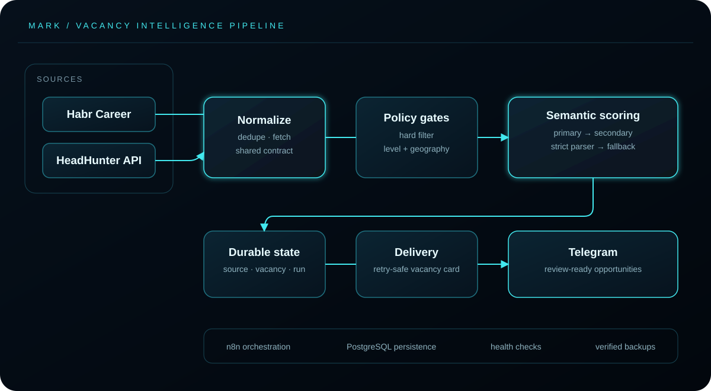
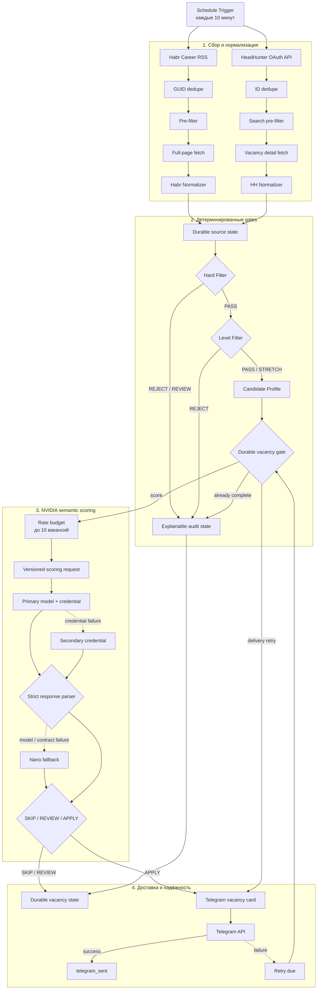

# MARK — AI Job Hunter

[](https://github.com/krasnov01012/mark-ai-job-hunter/actions/workflows/ci.yml)


> **RU:** Персональный AI-assisted мониторинг вакансий: Habr Career и
> HeadHunter → объяснимые policy gates → NVIDIA semantic scoring → Telegram.
>
> **EN:** A personal AI-assisted vacancy-monitoring pipeline: Habr Career and
> HeadHunter → explainable policy gates → NVIDIA semantic scoring → Telegram.

MARK — production-verified на зафиксированных acceptance checkpoints MVP,
построенный на n8n и JavaScript. Он нормализует вакансии из двух источников,
применяет детерминированные правила до обращения к LLM и формирует проверяемую
карточку с оценкой, аргументами и gaps. Проект не отправляет отклики и не выдаёт
personal-project work за коммерческий опыт.

**Review path:** [Architecture](#architecture--архитектура) ·
[Evidence](#проверенные-доказательства) · [Testing](docs/TESTING.md) ·
[Limitations](#ограничения) · [AI disclosure](#ai-assisted-authorship)

## Status / Статус

| Signal | Verified state |
|---|---|
| Scope | Personal single-user MVP; monitoring and delivery, no automatic applications |
| Public workflow | `54` nodes, `53` connection roots, inactive/import-safe export |
| Regression evidence | `16` test files, `1109` checks, `28` JavaScript syntax checks |
| Runtime checkpoint | Automatic ticks, container restart and server reboot recovery passed during M12/M13 acceptance |
| Public boundary | Credentials, production state, private data and deployment coordinates are excluded |

Runtime evidence is dated **26 July 2026**. The repository and its CI verify the
current public export; they do not claim uninterrupted availability of the
private runtime after that checkpoint.

## Architecture / Архитектура



The architecture keeps source-specific parsing before one normalized vacancy
contract. Deterministic filters own salary, geography, seniority, deduplication
and retry policy; the LLM is reserved for semantic fit, transferable skills,
gaps and explanation. Durable state makes every terminal decision auditable and
prevents repeated processing.

_Original vector prepared for the employer-facing portfolio from this
repository's documented architecture; no third-party visual assets are used._

## Что уже работает

- два независимых source-specific path: Habr Career RSS и HeadHunter API с
  application OAuth2;
- общий нормализованный vacancy contract после source-specific parsing;
- durable dedupe, bounded retries и сохранение состояния между запусками;
- hard filters для формата работы, географии и нерелевантных профессий;
- отдельный level filter для Senior/Lead/5+ year требований;
- Candidate Profile без заявлений о commercial или production-proven опыте;
- NVIDIA scoring с JSON schema, strict parser и active-passive credential/model
  fallback;
- Telegram card с HTML escaping, score, reasons и gaps;
- автономный n8n + PostgreSQL deployment, private access, health checks и
  проверяемые backups.

Salary не используется как фильтр и не уменьшает score при отсутствии.
Employer salary и Habr `predictedSalary` остаются разными полями. Full remote
проходит автоматически только при подтверждении, что работа доступна из
Georgia; неизвестная география получает `REVIEW`, явное ограничение другой
страной — `REJECT`. Hybrid и office допустимы только в Tbilisi, Georgia.

## Detailed pipeline / Подробная схема


```mermaid
flowchart TB
    T["Schedule Trigger<br/>каждые 10 минут"]

    subgraph SOURCES["1. Сбор и нормализация"]
        direction LR
        H["Habr Career RSS"] --> HD["GUID dedupe"] --> HP["Pre-filter"] --> HF["Full-page fetch"] --> HN["Habr Normalizer"]
        HH["HeadHunter OAuth API"] --> HHD["ID dedupe"] --> HHP["Search pre-filter"] --> HHDL["Vacancy detail fetch"] --> HHN["HH Normalizer"]
    end

    T --> H
    T --> HH
    HN --> DS["Durable source state"]
    HHN --> DS

    subgraph RULES["2. Детерминированные gates"]
        direction LR
        DS --> HARD{"Hard Filter"}
        HARD -- "REJECT / REVIEW" --> AUDIT["Explainable audit state"]
        HARD -- "PASS" --> LEVEL{"Level Filter"}
        LEVEL -- "REJECT" --> AUDIT
        LEVEL -- "PASS / STRETCH" --> PROFILE["Candidate Profile"]
        PROFILE --> VG{"Durable vacancy gate"}
        VG -- "already complete" --> AUDIT
    end

    subgraph SCORING["3. NVIDIA semantic scoring"]
        direction LR
        VG -- "score" --> BUDGET["Rate budget<br/>до 10 вакансий"]
        BUDGET --> REQ["Versioned scoring request"]
        REQ --> PRIMARY["Primary model + credential"]
        PRIMARY --> PARSE{"Strict response parser"}
        PRIMARY -. "credential failure" .-> SECONDARY["Secondary credential"]
        SECONDARY --> PARSE
        PARSE -. "model / contract failure" .-> NANO["Nano fallback"]
        NANO --> DECISION{"SKIP / REVIEW / APPLY"}
        PARSE --> DECISION
    end

    subgraph DELIVERY["4. Доставка и надёжность"]
        direction LR
        DECISION -- "SKIP / REVIEW" --> STATE["Durable vacancy state"]
        DECISION -- "APPLY" --> CARD["Telegram vacancy card"]
        VG -- "delivery retry" --> CARD
        CARD --> TG["Telegram API"]
        TG -- "success" --> SENT["telegram_sent"]
        TG -. "failure" .-> RETRY["Retry due"]
        AUDIT --> STATE
        RETRY --> VG
    end
```

Сплошные стрелки показывают основной путь, пунктирные — ограниченный fallback или retry. Решения `REJECT` и `REVIEW` сохраняются в durable state для аудита и защиты от повторной обработки.

Детерминированные правила принимают решения, которые можно проверить без LLM:
salary policy, work-format/geography gates, explicit seniority rejection,
dedupe, retries и delivery state. LLM используется только там, где нужна
семантика: transferable skills, fit, gaps и краткое объяснение.

## Проверенные доказательства

| Область | Проверенный результат |
|---|---|
| Workflow | `54` nodes, `53` connection roots, import-safe `active: false` |
| Public export | пустой `pinData`, production `staticData` удалён |
| Local regression | `16` test files, `1109` checks |
| Syntax/contracts | `28` JavaScript sources, Compose и shell contracts |
| Real integrations | HH OAuth/search, NVIDIA scoring/parser и controlled Telegram delivery |
| Autonomous runtime | два automatic ticks, container restart и server reboot recovery |
| Persistence | PostgreSQL entity restore, bounded state и читаемые backup pairs |
| CI | GitHub Actions проверяет syntax, все tests и Compose config |

Подробные test cases и ограничения приведены в
[TESTING](docs/TESTING.md). Исторические live execution IDs и deployment
acceptance сохранены в [CURRENT_STATE](docs/CURRENT_STATE.md), а устройство
pipeline — в [ARCHITECTURE](docs/ARCHITECTURE.md).

Production evidence относится к зафиксированным M12/M13 checkpoints. Текущая
repository-версия дополнительно ужесточает remote-from-Georgia policy и
проверена локальной regression matrix; на private target она ещё не
переустанавливалась.

## Быстрая локальная проверка

Требуется Node.js `22`. Команды не обращаются к реальным providers и не требуют
секретов:

```powershell
Get-ChildItem n8n\code,lib,scripts -Recurse -Include *.js,*.mjs |
  ForEach-Object { node --check $_.FullName }

Get-ChildItem tests -Filter *.test.js |
  Sort-Object Name |
  ForEach-Object { node $_.FullName }

node scripts\build-main-workflow.mjs --dry-run
docker compose --env-file deploy\mark\.env.example -f deploy\mark\compose.yaml config --quiet
```

CI выполняет тот же основной gate на Ubuntu.

## Импорт и запуск

Checked-in workflow — чистый шаблон: он выключен, не содержит production state
и не запускает Schedule Trigger после импорта.

```powershell
n8n import:workflow --input="n8n\workflows\ai-job-hunter-main.json"
```

Перед controlled publication в n8n нужно создать:

- HeadHunter OAuth2 API credential;
- два NVIDIA HTTP Header Auth credentials;
- Telegram credential;
- `MARK_TELEGRAM_CHAT_ID` в environment.

Safe placeholders находятся в [config/.env.example](config/.env.example) и
[deploy/mark/.env.example](deploy/mark/.env.example). Container deployment,
migration, backup и rollback описаны в
[DEPLOYMENT](docs/DEPLOYMENT.md). Значения credentials, OAuth tokens, bot token,
Chat ID, databases и entity exports не должны попадать в workflow JSON,
fixtures, docs или Git.

Production delivery принят 1 сентября 2026 года: сервер тянет только exact
semantic tags через отдельный read-only deploy key. Forced drill доказал
восстановление PostgreSQL+n8n-data `v0.1.3 → v0.1.2`; после него `v0.1.3`
установлен штатно и прошёл health. Детали и ограничения — в
[DEPLOYMENT](docs/DEPLOYMENT.md) и [TESTING](docs/TESTING.md).

## Структура репозитория

```text
config/             safe model, provider and environment contracts
deploy/mark/        n8n + PostgreSQL container package
docs/               architecture, state, roadmap, deployment and testing
lib/                reusable deterministic provider fallback
n8n/code/           editable JavaScript sources for Code nodes
n8n/workflows/      clean importable workflow export
scripts/            workflow builders and verification utilities
tests/              deterministic regression matrices
```

Код в `n8n/code/` является source of truth для Code nodes. После изменения
matching node обновляется через `scripts/build-main-workflow.mjs`, затем
проверяется exact source equality в `workflow-structure.test.js`.

## Security и privacy

- `.env`, n8n databases, credentials, backups, private keys и migration
  artifacts исключены из Git;
- checked-in workflow не содержит literal keys, Bearer tokens, OAuth secrets,
  Chat ID, email addresses, local user paths, `pinData` или production
  `staticData`;
- credential values хранятся только в encrypted n8n store и external
  root-owned environment;
- n8n публикуется через loopback/private network, а не через открытый
  application port;
- workflows из repository export остаются inactive до отдельного controlled
  publication step.

## Ограничения

- Это персональный MVP, не SaaS и не система автоматической подачи заявок.
- Durable application state пока использует bounded
  `getWorkflowStaticData('global')`; для multi-user scale нужен отдельный
  PostgreSQL/Data Table contract.
- Неизвестная доступность remote-вакансии из Georgia не угадывается и остаётся
  `REVIEW`.
- Provider credentials и реальная Telegram delivery проверяются только в
  private environment владельца.
- Продолжительный soak, quota scope, external alert delivery и offsite restore
  остаются отдельными operational acceptance gates.

## AI-assisted authorship

Проект разработан с существенной помощью Codex и Claude. Роль владельца:
постановка задачи, продуктовые ограничения, acceptance criteria, выбор
trade-offs, live-операции и проверка результатов. Репозиторий не заявляет, что
весь код написан вручную без AI, и не выдаёт personal projects за коммерческий
production experience.

## Документация

- [CURRENT_STATE](docs/CURRENT_STATE.md) — проверенный статус и ближайший шаг;
- [ARCHITECTURE](docs/ARCHITECTURE.md) — contracts, pipeline и failure behavior;
- [TESTING](docs/TESTING.md) — regression matrix и live evidence;
- [DEPLOYMENT](docs/DEPLOYMENT.md) — migration, cutover, backup и rollback;
- [ROADMAP](docs/ROADMAP.md) — завершённые MVP stages и оставшиеся gates;
- [PROVIDER_FALLBACK](docs/PROVIDER_FALLBACK.md) — NVIDIA fallback contract.
